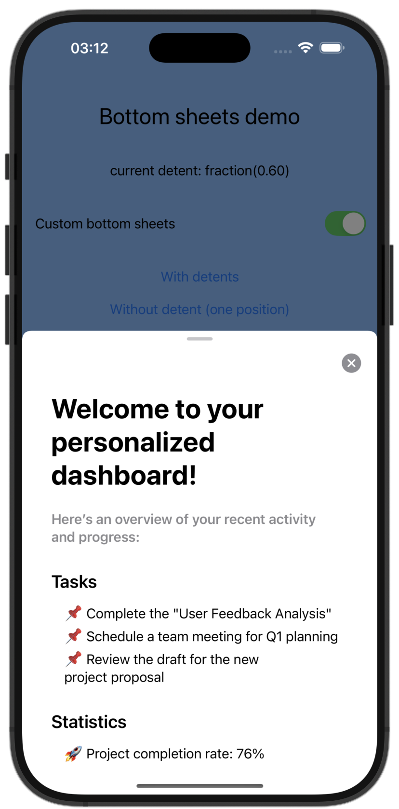

# BottomSheets

[](https://github.com/c-villain/BottomSheets/releases/latest)
[](https://swift.org/package-manager/)


[](https://t.me/lexkraev)
[](https://telegram.dog/swiftui_dev)

<picture>
  
</picture>

This package provides a custom implementation of the native SwiftUI's bottom sheet component for devices running iOS < 16.4. 

The SwiftUI's bottom sheet [```presentationDetents(_:)```](https://developer.apple.com/documentation/swiftui/view/presentationdetents(_:)) is only available starting from iOS 16, and many useful modifiers (such as [```presentationBackgroundInteraction(_:)```](https://developer.apple.com/documentation/swiftui/view/presentationbackgroundinteraction(_:))) were introduced even later, in iOS 16.4. 

```BottomSheets``` is quite similar to backport one, so that you can start targeting yours apps with bottom sheets on older versions of iOS from iOS 14.0.

> [!IMPORTANT]
> The main idea is that if your device runs on a platform newer than iOS 16.4, it will use native bottom sheets under the hood. You can easily disable this behavior using modifier `nativeBottomSheetDisabled(:)`. Read below.


👨🏻‍💻 Feel free to subscribe to channel **[SwiftUI dev](https://t.me/swiftui_dev)** in telegram.


## Requirements

- iOS 14.0

## Installation

#### Swift Package Manager

To integrate ```BottomSheets``` into your project using SwiftPM add the following to your `Package.swift`:

```swift
dependencies: [
    .package(url: "https://github.com/c-villain/BottomSheets", from: "1.0.0"),
],
```
or via [XcodeGen](https://github.com/yonaskolb/XcodeGen) insert into your `project.yml`:

```yaml
name: YourProjectName
options:
  deploymentTarget:
    iOS: 14.0
packages:
  BottomSheets:
    url: https://github.com/c-villain/BottomSheets
    from: 1.0.0
targets:
  YourTarget:
    type: application
    ...
    dependencies:
       - package: BottomSheets
```

## Quick start

```bottomSheet(isPresented:detents:selection:interaction:content:)```

Presents a bottom sheet when a binding to a Boolean value that you provide is true.

```swift
@ViewBuilder
func bottomSheet<BottomSheetContent: View>(
    isPresented: Binding<Bool>,
    _ detents: Set<BPresentationDetent> = [.medium],
    selection: Binding<BPresentationDetent>? = nil,
    interaction: BPresentationBackgroundInteraction = .automatic,
    @ViewBuilder content: @escaping () -> BottomSheetContent
) -> some View
```

### Parameters

- **isPresented**: *a `Binding` to a Boolean value that determines whether to present the sheet that you create in the modifier’s content closure.*
- **detents**: *a set of supported detents for the sheet. If you provide more that one detent, people can drag the sheet to resize it.*
- **selection**: *a `Binding` to the currently selected detent. Ensure that the value matches one of the detents that you provide for the detents parameter.*
- **interaction**: *a specification of how people can interact with the view behind a presentation.*
- **content**: *a closure that returns the content of the sheet.*

### Example

<details>
  <summary>Sheet without detents</summary>

```swift
import BottomSheets
import SwiftUI

struct YouView: View {
  @State private var showWithoutDetents: Bool = false
  
  var body: some View {
    MainView()
      .bottomSheet(isPresented: $showWithoutDetents) {
        YourBottomSheetContent()
      }
  }
}
```

</details>

<details>
  <summary>Sheet with multiple detents</summary>

```swift
import BottomSheets
import SwiftUI

struct YouView: View {
  @State private var showWithDetents: Bool = false
  @State private var currentDetent: BPresentationDetent = .medium

  var body: some View {
    MainView()
      .bottomSheet(
            isPresented: $showWithDetents,
            [.height(300), .medium, .fraction(0.60), .fraction(0.90)],
            selection: $currentDetent
        ) {
        YourBottomSheetContent()
      }
  }
}
```

</details>

> [!NOTE]
> You can find more examples in the demo application included in the project.


### Backported

✅ [`PresentationDetent`](https://developer.apple.com/documentation/swiftui/presentationdetent) -> `BPresentationDetent`

<details>
  <summary>Example of usage</summary>

```swift
@State private var detent: BPresentationDetent = .medium
```

</details>

✅ [`PresentationBackgroundInteraction`](https://developer.apple.com/documentation/swiftui/presentationbackgroundinteraction) -> `BPresentationBackgroundInteraction`

✅ [`interactiveDismissDisabled`](https://developer.apple.com/documentation/swiftui/view/interactivedismissdisabled(_:)) -> `bInteractiveDismissDisabled`

<details>
  <summary>Example of usage</summary>

```swift
.bottomSheet(
    isPresented: $showBottomSheet,
    [.height(200), .height(300)],
    selection: $currentDetent
) {
    YourBottomSheetContent()
      .bInteractiveDismissDisabled() // <= Look here ✅
}
```

</details>

✅ [`Visibility`](https://developer.apple.com/documentation/swiftui/visibility) -> `BVisibility`  

✅ [`presentationDragIndicator`](https://developer.apple.com/documentation/swiftui/view/presentationdragindicator(_:)) -> `bPresentationDragIndicator` 

<details>
  <summary>Example of usage</summary>

```swift
.bottomSheet(
    isPresented: $showBottomSheet,
    [.height(200), .height(300)],
    selection: $currentDetent
) {
    YourBottomSheetContent()
      .bPresentationDragIndicator(.hidden) // <= Look here ✅
}
```
</details>


✅ [`presentationBackground`](https://developer.apple.com/documentation/swiftui/view/presentationbackground(_:)) -> `bPresentationBackground` 

<details>
  <summary>Example of usage</summary>

```swift
.bottomSheet(
    isPresented: $showBottomSheet,
    [.height(200), .height(300)],
    selection: $currentDetent
) {
    YourBottomSheetContent()
      .bPresentationBackground(Color.blue) // <= Look here ✅
}
```
</details>


✅ [`presentationCornerRadius`](https://developer.apple.com/documentation/swiftui/view/presentationcornerradius(_:)) -> `bPresentationCornerRadius` 

<details>
  <summary>Example of usage</summary>

```swift
.bottomSheet(
    isPresented: $showBottomSheet,
    [.height(200), .height(300)],
    selection: $currentDetent
) {
    YourBottomSheetContent()
      .bPresentationCornerRadius(20) // <= Look here ✅
}
```
</details>

## Additional features

<details>
  <summary>nativeBottomSheetDisabled</summary>

As already mentioned, the main idea of this pacakge is that if your device runs on a platform newer than iOS 16.4, it will use native bottom sheets under the hood. 

You can easily disable this behavior using modifier `nativeBottomSheetDisabled(:)`

In other words, modifier `nativeBottomSheetDisabled(_ isDisabled: Bool)` allows you to use custom bottom sheets by default.

```swift
.bottomSheet(
    isPresented: $showBottomSheet,
    [.height(200), .height(300)],
    selection: $currentDetent
) {
    YourBottomSheetContent()
}
.nativeBottomSheetDisabled(true) // <= Look here ✅
```

</details>

<details>
  <summary>presentationContentOverlay(_ color: Color)</summary>

Modifier `presentationContentOverlay(_ color: Color)` allows you to adjust the main content view dimming

```swift
.bottomSheet(
    isPresented: $showBottomSheet,
    [.height(200), .height(300)],
    selection: $currentDetent
) {
    YourBottomSheetContent()
      .presentationContentOverlay(Color.red.opacity(0.5)) // <= Look here ✅
}
```

</details>
 
<details>
  <summary>presentationOverDragLimit(_ limit: CGFloat)</summary>

Modifier `presentationOverDragLimit(_ limit: CGFloat)` allows you to set the pull-back effect for the bottom sheet

```swift
.bottomSheet(
    isPresented: $showBottomSheet,
    [.height(200), .height(300)],
    selection: $currentDetent
) {
    YourBottomSheetContent()
      .presentationOverDragLimit(20) // <= Look here ✅  pull-back effect with 20 pt
}
```

</details>

<details>
  <summary>presentationShadow(color: Color, radius: CGFloat, x: CGFloat, y: CGFloat)</summary>

Modifier `presentationShadow(color: Color, radius: CGFloat, x: CGFloat, y: CGFloat)` allows you to set a shadow effect for the bottom sheet 

```swift
.bottomSheet(
    isPresented: $showBottomSheet,
    [.height(200), .height(300)],
    selection: $currentDetent
) {
    YourBottomSheetContent()
      .presentationShadow(radius: 5) // <= Look here ✅  Add 5 pt radius for bottom sheet
}
```

</details>

## Communication

- If you **found a bug**, open an issue or submit a fix via a pull request.
- If you **have a feature request**, open an issue or submit a implementation via a pull request or hit me up on **lexkraev@gmail.com** or **[telegram](https://t.me/lexkraev)**.
- If you **want to contribute**, submit a pull request onto the master branch.

## License

BottomSheets package is released under an MIT license.
